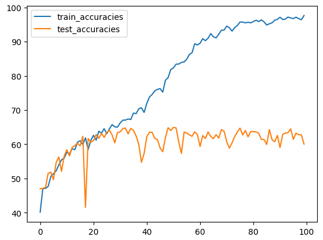
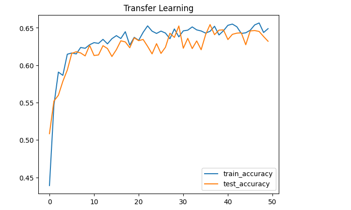
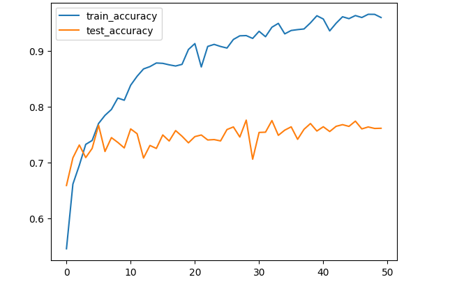

# [PROJECT] Leaf Classification Train From Scratch and Transfer Learning

## Introduction

This project aims to classify cassava leaf diseases by training a model from scratch and using transfer learning techniques to evaluate the model.

## Notices

* We will split our datasets becoming two part with 80% train datasets and 20% test set.
* This project use Basic CNN and Fine-Turning with weight of ResNet18_Weights.IMAGENET1K_V1
## RESULT
With training from Scratch, we have appromimately 64,93%.
 

With the higher accuracy is Transfer learning, we only change dense layer, all weights i will freeze it, reach 65% accuracy.

 
I have highest accuracy with fine-turning model, reach nearly 80% accuracy.

 

## Requirements
* **Python**
* **Basic knowledge of nlp**
* **Cosine similarity**
